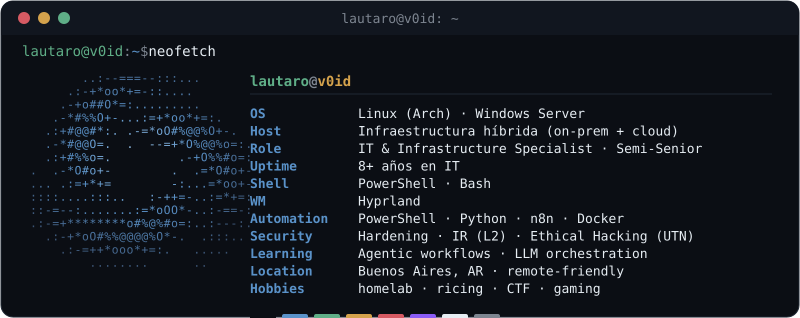

<!--
  README del perfil → repo especial callofthev0id/callofthev0id
  Assets en /assets: github-banner.svg · v0-avatar.svg · neofetch.svg · separator.svg
  Snake: .github/workflows/snake.yml genera el SVG a la rama output.
  Al mover al repo real, cambiar las URLs raw de snake (readme-preview → callofthev0id).
  Identidad: branding/design-system.md · Reglas: nada de labels de status, nada de narrativa vacía.
-->

<div align="center">
  
</div>

<div align="center">
  <a href="https://www.linkedin.com/in/lautaromero/"></a>
  <a href="mailto:lau.romero@proton.me"></a>
  
  
</div>

<br>

IT & Infrastructure Specialist desde Buenos Aires. Administro infraestructura híbrida Windows/Cloud y, desde 2026, construyo automatización y tooling interno apoyado en IA.

Me gusta entender los sistemas de punta a punta: hardware, red, servidores, seguridad y automatización. Acá junto mi trabajo profesional con los proyectos que armo por cuenta propia.

<div align="center">
  
</div>


### Stack


```text
Sistemas        Windows Server · Linux · Active Directory · Microsoft 365 / Entra ID · Exchange
Virtualización  Hyper-V · VMware · Docker
Automatización  PowerShell · Python · Bash · n8n
Web / Data      Next.js · React · Tailwind · Flask · PostgreSQL · SQLite
Herramientas    Git · Claude Code
```


### Proyectos

Extractos sanitizados de despliegues reales (código y docs reales; datos y credenciales reemplazados).

| Proyecto | Qué es | Stack |
|----------|--------|-------|
| [**MSP Operations CRM**](https://github.com/callofthev0id/sti-web) | Centraliza clientes, tickets, inventario, diagnósticos y facturación integrando en vivo RMM, monitoreo, EDR y ERP |    |
| [**Automation Suite**](https://github.com/callofthev0id/n8n-automation-suite) | Reconciliación de inventario entre herramientas + agente de IA conversacional (NOC) |    |
| [**Sinkhole**](https://github.com/callofthev0id/eon-adguard) | Filtrado DNS cifrado (DoT/DoH) para flota remota, con hardening de firewall |    |
| [**Prode Mundial 2026**](https://github.com/callofthev0id/sti-prode) | Juego de pronósticos: bracket propio por jugador, sync de resultados en vivo, audit log HMAC |    |
| **Liga** <sub>(privado)</sub> | App de liga de fútbol: bitácora, Prode y estadísticas, con múltiples integraciones |    |
| [**Fleet Maintenance Toolkit**](https://github.com/callofthev0id/sti-mant) | Auditoría y mantenimiento de flotas Windows con reportes de seguridad |  |


### Contribuciones

<div align="center">
  <picture>
    <source media="(prefers-color-scheme: dark)" srcset="https://raw.githubusercontent.com/callofthev0id/callofthev0id/output/snake-dark.svg">
    
  </picture>
</div>


### Contacto

- LinkedIn — [in/lautaromero](https://www.linkedin.com/in/lautaromero/)
- Email — lau.romero@proton.me
